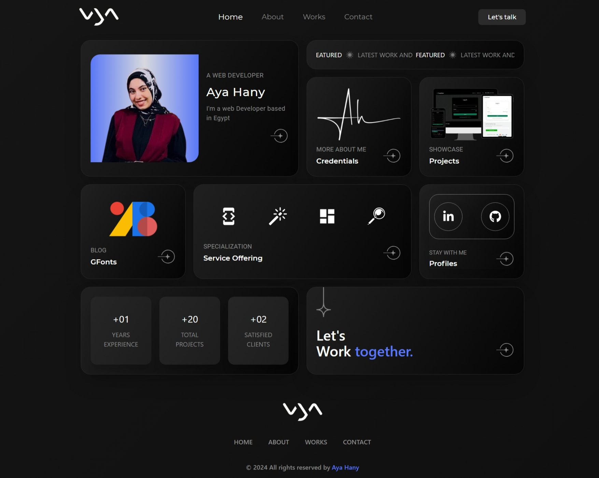

# 🌟 Aya Hany - Portfolio Website



Welcome to my personal portfolio website! This is not just a showcase of my work—it's a glimpse into my journey, skills, and dedication as a front-end developer. I’ve designed this site to reflect my personality, creativity, and technical expertise while providing an engaging and user-friendly experience for visitors.

## 🌐 Live Demo

✨ [Visit My Portfolio on Vercel](https://portfolio-delta-pied-34.vercel.app/)
✨ [Visit My Portfolio on Netlify] (https://ayahsportfolio.netlify.app)

---

## 📖 About the Project

I created this portfolio to highlight my growth and passion for web development. It’s a space where potential clients, recruiters, and collaborators can explore my work and understand my skills in depth. From animations to interactivity, every element on this website is a result of my focus on delivering an exceptional user experience.

### 🎨 Purpose & Goals

- **Showcase My Work:** A dedicated section for projects that reflect my capabilities in React.js, Tailwind CSS, and modern libraries.
- **Provide Services Information:** Let visitors know the services I offer in web development.
- **Streamlined Communication:** An easy-to-use contact form powered by EmailJS to facilitate direct communication.
- **Interactive Storytelling:** Leveraging animations and interactive elements to tell my story in an engaging way.

---

## ✨ Features

- **Beautiful Landing Page:** Welcomes visitors with a professional yet friendly design.
- **Dynamic About Section:** Shares my journey, values, and the technologies I excel in.
- **Interactive Project Showcase:** Displays my top projects with detailed descriptions, live links, and technologies used.
- **Services Overview:** A clear presentation of the services I offer, including web design, responsive development, and animations.
- **Contact Form:** Powered by EmailJS, enabling visitors to connect with me seamlessly.
- **Real-Time Notifications:** Thanks to Notistack, visitors receive immediate feedback when they interact with the site.
- **Animations:** Smooth transitions and engaging effects built using GSAP to create a memorable browsing experience.
- **Responsive Design:** Fully optimized for mobile, tablet, and desktop devices to ensure accessibility.

---

## 🛠️ Technologies Used

This portfolio leverages the following tools and libraries to provide a top-tier experience:

### **Frontend Frameworks & Libraries:**

- **React.js:** The backbone of my website, providing a modular and efficient structure.
- **React Router DOM:** For seamless navigation between pages.

### **Styling & Animations:**

- **Tailwind CSS:** To create a modern and responsive design with minimal effort.
- **GSAP (GreenSock Animation Platform):** For dynamic animations that bring the site to life.
- **React Icons:** Adding an aesthetic touch with lightweight, customizable icons.

### **Forms & Validation:**

- **Formik:** Simplifies form handling with minimal boilerplate.
- **Yup:** For robust and flexible form validation.

### **Email Service & Notifications:**

- **EmailJS:** Enables a functional contact form that directly sends messages to my inbox.
- **Notistack:** Provides non-intrusive, responsive notifications for user actions.

---

## 🚀 Getting Started

### Prerequisites

Before running the project, ensure you have the following installed:

- **Node.js** and **npm** (for managing dependencies and running the app).

### Installation

1. Clone the repository:
   ```bash
   git clone https://github.com/AyaHany0/portfolio.git
   ```
2. Navigate to the project directory:
   ```bash
   cd portfolio
   ```
3. Install dependencies:
   ```bash
   npm install
   ```
4. Start the development server:
   ```bash
   npm run dev
   ```

### Building for Production

To build the project for deployment:

```bash
npm run build
```

---

## 💡 Usage

- **Recruiters/Clients:** Explore my skills, projects, and contact me for potential collaborations.
- **Developers:** Get inspired by my design, structure, and choice of libraries. Feel free to fork the repo and customize it for your portfolio!

---

## 🎯 Future Enhancements

I’m continuously working to improve my portfolio. Here are some ideas for future updates:

1. **Blog Section:** Share tutorials, insights, and experiences in web development.
2. **Light Mode:** Enhance accessibility and provide a personalized browsing experience.
3. **Project Filter/Search:** Allow visitors to filter projects by technology or category.
4. **CMS Integration:** Use a headless CMS to easily add new projects and updates.

---

## 🙌 Acknowledgments

Creating this portfolio has been an exciting journey, and I’d like to thank the following:

- The open-source community for providing the amazing tools and libraries I’ve used.
- My mentors, peers, and clients who inspire me to keep learning and growing.
- Design inspiration from platforms like [Dribbble](https://dribbble.com/) and [Behance](https://www.behance.net/).

---

## 📞 Contact

I’d love to hear from you! Whether it’s a potential project, a question, or just to say hi, feel free to reach out:

- **Email:** ayah28603@gmail.com
- **LinkedIn:** [Aya Hany](https://www.linkedin.com/in/ayahany/)

---

## 🖤 Contributing

Contributions are welcome! If you’d like to enhance this project or report an issue, feel free to fork the repository and create a pull request.

---

## 📜 License

This project is licensed under the **MIT License**.
